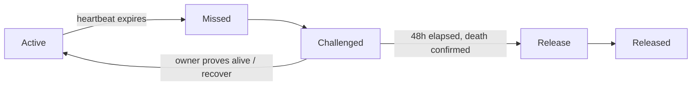
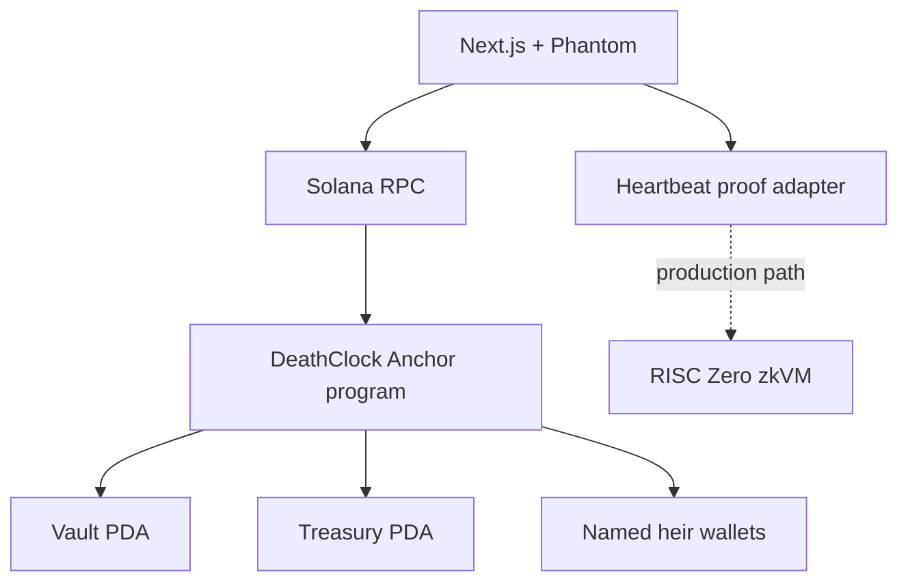

# DeathClock

**Your will, on-chain.** DeathClock is a trustless crypto inheritance protocol for Solana. An owner deposits SOL into a PDA vault, proves they are alive with a heartbeat, and names the beneficiaries who receive the estate after a 48-hour challenge window.

> MVP status: the Anchor program, local validator integration suite, proof adapter, and frontend production build are working. The current on-chain heartbeat verifier is deliberately tagged `DEATHCLOCK_MOCK_V1`; the RISC Zero guest/host boundary is scaffolded and unit-tested, but is not yet the on-chain verifier.

## The problem

Crypto makes value transferable, but it does not make succession humane. A lost seed phrase or an inaccessible wallet can strand an estate indefinitely. Existing transfers require an executor and a trusted intermediary; the owner cannot pre-authorize a clear, time-bounded release policy.

DeathClock turns that policy into a small state machine:



## Architecture



The on-chain program is the source of truth for ownership, shares, state transitions, and lamport movement. The UI never claims a release is complete until the chain confirms it.

## Repository layout

- `programs/deathclock/` — Anchor program and integration tests.
- `zk/` — RISC Zero-compatible heartbeat boundary plus deterministic local proof adapter.
- `app/` — Next.js 14 App Router frontend with Phantom connection and responsive editorial UI.
- `scripts/` — deployment and demo workflow scripts.
- `docs/ARCHITECTURE.md` — component, state-machine, and sequence diagrams.
- `docs/DEMO.md` — judge-facing demo script and local validator walkthrough.

## Quick start

### 1. Build and test the program

Anchor runs in the provided Linux toolchain image on Windows:

```bash
docker run --rm \
  -v "$PWD:/workspace" \
  -v sanitova_solana_cargo:/usr/local/cargo/registry \
  -v sanitova_solana_cache:/root/.cache/solana \
  -w /workspace sanitova-solana bash -lc 'anchor build'
```

Start a local validator with the built program injected at genesis:

```bash
docker run --rm --name deathclock-validator \
  --security-opt seccomp=unconfined \
  -p 8899:8899 -p 8900:8900 \
  -v "$PWD:/workspace" -v sanitova_solana_cache:/root/.cache/solana \
  -w /workspace sanitova-solana bash -lc \
  'rm -rf /tmp/test-ledger && solana-test-validator --reset --quiet --ledger /tmp/test-ledger --bpf-program target/deploy/deathclock-keypair.json target/deploy/deathclock.so'
```

In a second terminal:

```bash
npm install
npm run test:local
```

Expected result: **6 passing** integration tests, covering initialization, malformed shares, the full inheritance lifecycle, invalid proof, emergency recovery, and the challenge period.

### 2. Run the ZK adapter tests

The host is tested in the same Linux image because native Windows does not provide the Rust/Solana toolchain:

```bash
docker run --rm \
  -v "$PWD:/workspace" \
  -v sanitova_solana_cargo:/usr/local/cargo/registry \
  -v sanitova_solana_cache:/root/.cache/solana \
  -w /workspace sanitova-solana bash -lc \
  'cargo test -p deathclock-zk -p deathclock-zk-methods'
```

### 3. Run the frontend

```bash
cd app
npm install
npm run dev
```

Open `http://localhost:3000`. The production build is verified with:

```bash
npm run build
```

Set `NEXT_PUBLIC_RPC_URL` to use a different Solana cluster. The default is devnet.

### 4. Deploy to devnet

Fund a deploy wallet, configure Solana CLI for devnet, then run:

```bash
CLUSTER=devnet bash scripts/deploy.sh
```

The script builds, deploys, prints the program ID, and tells you how to verify it. It does not rewrite the source program ID or expose keypair material.

## Protocol rules

- Heartbeat interval: 30 days (`2,592,000` seconds).
- Challenge period: 48 hours (`172,800` seconds).
- Protocol fee: 0.5% (`5 / 1000`) of the distributable vault balance.
- Maximum heirs: five; shares must be non-zero and total 100%.
- Vault PDA: `["vault", owner]`.
- Treasury PDA: `["treasury"]`, validated by canonical bump.
- Release state is one-way and preserves the vault rent reserve.

## Honest limitations

1. The heartbeat proof accepted by the program is a local mock tag, not a RISC Zero receipt. Do not describe it as production ZK verification.
2. The frontend now sends real Anchor transactions through the connected Phantom wallet, but the default program ID is a local/demo deployment identity. Verify the deployed program ID and cluster before using devnet funds.
3. `anchor test` is not the canonical test command on this Windows setup; `npm run test:local` runs against the injected local validator and is the verified command.
4. Devnet deployment requires SOL and a configured Solana wallet; no credentials are committed to this repository.

## Demo narrative

Use David’s story: 45, owner, 500,000 SOL, wife and two children as beneficiaries. Start the local validator, create a 60/20/20 vault, deposit 10 SOL, send an initial heartbeat, then use the test suite or a time-aware devnet fixture to walk through the missed-heartbeat and challenge states. The full runbook is in [`docs/DEMO.md`](docs/DEMO.md).

## Roadmap

- Pin and build a reproducible RISC Zero guest image.
- Replace the mock verifier with receipt verification against a deployed method ID.
- Wire frontend transaction methods to a devnet program and add wallet error recovery.
- Add a monitored treasury policy, monitoring, and a production incident runbook.
