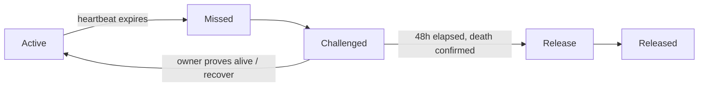
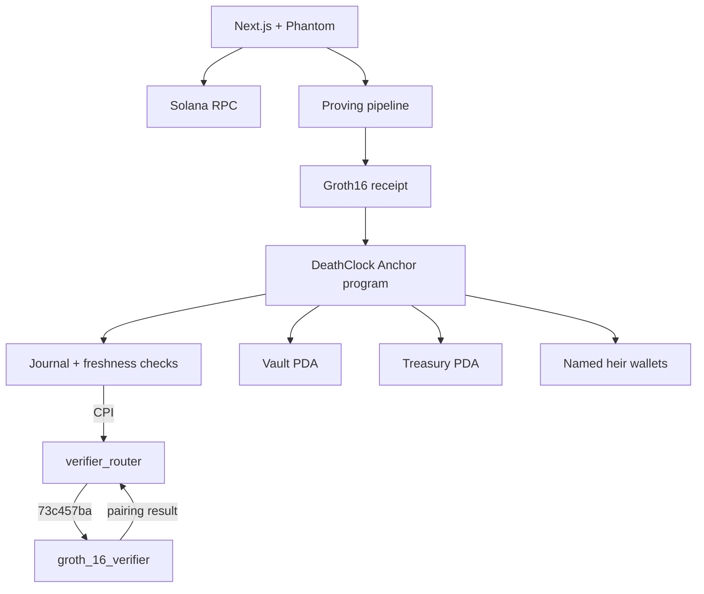

# DeathClock

**Your will, on-chain.** DeathClock is a trustless inheritance protocol for Solana. An owner deposits SOL into a PDA vault, proves they are alive with a zero-knowledge heartbeat, and names the beneficiaries who receive the estate after a 48-hour challenge window.

The heartbeat is a real RISC Zero proof, verified on-chain by Solana. Not a mock, not a signature, not an oracle assertion.

```
DeathClock ──CPI──▶ verifier_router ──selector 73c457ba──▶ groth_16_verifier
                                                                   │
                                            BN254 pairing check on the SNARK
```

- Verified heartbeat transaction `5ngg4ghZrVjemXhr2fZ6GJ2i31w5nm3ow7S1CHaAy9n4YKDADdDwhABB5QYSGsfXFwzopZZZc585KnqgdeSMSkqN`, confirmed against a local validator running Solana 1.18.26.
- The proof path is now wired on devnet too: all three programs are deployed, and the Groth16 verifier is registered with the router under selector `73c457ba` by transaction [`2n96CPsM…`](https://explorer.solana.com/tx/2n96CPsM6Ga8BPjAGtHMyriNGxm2QHm36jqQvVoX2ubSs7wzP1nfuWErNqrdsW9gUQCro3ftZcjLHGmScGVfrWhS?cluster=devnet), which logs `Instruction: AddVerifier`. The remaining step is submitting a heartbeat with a freshly generated seal, which needs a prover -- see the limitations below.
- Tamper case: the same receipt with a modified journal is **rejected**.
- Live on devnet: vault [`GdqwHKfJ7wgNSGJ53J7mrA986Tg1UefUK9Y3btzX7Btt`](https://explorer.solana.com/address/GdqwHKfJ7wgNSGJ53J7mrA986Tg1UefUK9Y3btzX7Btt?cluster=devnet) — 0.4 SOL deposited, two heirs at 60/40, created and funded by `npm run e2e:devnet`. Reproduce with `npm run verify:live-vault`, which decodes it through the same path the deployed site uses.

## The problem

Roughly $140 billion in Bitcoin is unreachable — lost seed phrases, deceased holders with no executor, hardware wallets nobody can open. Crypto made value transferable but did nothing for succession. Every existing path needs a lawyer, a court, or a trusted intermediary, and none of them let you pre-authorize a release policy while you are still well.

DeathClock turns that policy into a small state machine:



The false-alarm case is the design constraint that matters most. Anyone can stop sending heartbeats to trigger a payout, so a heartbeat must be a *proof of life*, not an absence of activity, and a release must survive the owner showing up late.

## How the heartbeat works

Every 30 days the owner must produce a Groth16 proof that a guest program executed correctly. The on-chain program accepts it only if:

1. The receipt's image ID matches the pinned guest image (`83a26d8b…c94ed`).
2. The journal is self-consistent: `commitment == SHA-256(owner[32] || timestamp_le[8] || nonce[24])`.
3. The timestamp is within 300 seconds of chain time — this is what makes a replayed receipt worthless.
4. The router's `groth_16_verifier` accepts the BN254 pairing check.

The public input is `SHA-256(journal_outputs)`. The journal is 64 bytes: a commitment to the owner's identity, the timestamp, and a 24-byte nonce. The verifier learns *that* the owner is alive, and nothing else.

**Privacy is the point.** A proof of death is broadcast to everyone, and so is a proof of life — inheritance is a deeply private matter, and the public chain should not record either. The guest reads the owner key and outputs only a commitment.

## Architecture



The on-chain program is the source of truth for ownership, shares, state transitions, and lamport movement. The UI never claims a release is complete until the chain confirms it.

Verifier source is vendored under `vendor/risc0-solana/` so the exact binary that runs on-chain is reproducible from this repository. DeathClock has no direct on-chain `risc0-zkvm` dependency — it only CPIs the router.

## Business model

The protocol takes **0.5% of the distributable vault balance** at release, paid to the treasury PDA. It is charged only on a successful inheritance, never on deposits, heartbeats, or a recovered false alarm. The owner pays nothing while alive.

The rationale is that the fee is collected exactly once, at the moment value actually moves and the heirs would otherwise need an executor.

## Protocol rules

| Rule | Value |
|---|---|
| Heartbeat interval | 30 days (`2,592,000` s) |
| Challenge period | 48 hours (`172,800` s) |
| Proof freshness window | 300 s (`PROOF_MAX_AGE_SECONDS`) |
| Proof clock skew allowance | 60 s (`PROOF_MAX_FUTURE_SECONDS`) |
| Protocol fee | 0.5% (`5 / 1000`) of distributable balance |
| Maximum heirs | 5; shares non-zero, totalling 100% |
| Vault PDA | `["vault", owner]` |
| Treasury PDA | `["treasury"]`, canonical bump |

## Repository layout

- `programs/deathclock/` — Anchor program, generated IDL, and the real-receipt E2E test.
- `zk/` — RISC Zero guest, host crate, and the two-phase proving pipeline.
- `vendor/risc0-solana/` — vendored `verifier_router` and `groth_16_verifier`.
- `app/` — Next.js 14 frontend with Phantom connection.
- `scripts/` — proving, E2E, deployment, and VPS tunnel scripts.
- `docs/ARCHITECTURE.md` — component and sequence diagrams.
- `docs/POSTMORTEM.md` — the failures behind this build, and what caused them.
- `docs/DEMO.md` — judge-facing demo script.

## Reproducing the verified heartbeat

The proving pipeline needs Docker. Phase 1 (STARK) and phase 2 (seal assembly) run in the toolchain image; the Groth16 wrap runs the prover image directly from the host, because a nested container cannot see the build container's filesystem.

```bash
# Terminal 1 — a validator with all three programs at genesis.
bash scripts/localnet-e2e.sh          # or point DEATHCLOCK_RPC at a remote validator
```

With a validator on a separate host, start the tunnel first and skip local validator startup:

```bash
bash scripts/vps-tunnel.sh            # self-healing, forwards RPC and WebSocket
DEATHCLOCK_RPC=http://127.0.0.1:8899 DEATHCLOCK_RPC_EXTERNAL=1 \
  bash scripts/localnet-e2e.sh
```

Expected output:

```
✔ opens and funds the vault before the proof is used
✔ accepts a journal whose commitment is self-consistent
✔ submits the receipt and the router verifies it on-chain
✔ rejects the same proof once the journal is tampered with

4 passing
```

Run the ZK unit tests — including the two regressions for the BN254 modulus bug described in the postmortem — with:

```bash
docker run --rm -v "$PWD:/workspace" \
  -v sanitova_solana_cargo:/root/.cargo \
  -v sanitova_solana_zk_target:/build-target \
  -w /workspace -e CARGO_TARGET_DIR=/build-target \
  sanitova-solana bash -lc 'cargo test -p deathclock-zk'
```

## Devnet deployment

All three programs are live on public devnet, each verified by reading the
account back from the cluster (`executable: true`, owned by
`BPFLoaderUpgradeab1`) rather than by trusting a deploy signature.

| Program | Devnet address |
|---|---|
| `deathclock` | `C8unxtjoDZWy2GmwHUPuSve1BHT5TtRKpNaDofbMS5Vh` |
| `verifier_router` | `5n8zx79RUHafwSSB4vRU5ao9atHzJQHTdJR9ty8YrVte` |
| `groth_16_verifier` | `2iPoTWMXWJ6inLnBeGEZyiKkwEzaQvCX24Cp82UcWm8K` |

Router state `7NHg6MZbtSaxJ7DQzdFCXLd1ZCJgHiYA2epxbGYYcPpQ` is initialized
and owned by the router program.

The **proof path is wired on devnet**. `add_verifier` requires the router PDA
to hold the verifier's upgrade authority, and LoaderV3 forbids `SetAuthority`
as a CPI -- but `solana program set-upgrade-authority
--skip-new-upgrade-authority-signer-check` hands it over in a top-level
transaction, since a PDA cannot co-sign the default checked form. See
`docs/POSTMORTEM.md` §6 for how this was established, including the two dead
ends on the way.

| | |
|---|---|
| Verifier entry | `HFAWG7uYosXrfWHho4Q7Q3BqxcqqEAA8UsRUhjskHycF` |
| Selector | `73c457ba` |
| `estopped` | `false` |
| Registered by | [`2n96CPsM…`](https://explorer.solana.com/tx/2n96CPsM6Ga8BPjAGtHMyriNGxm2QHm36jqQvVoX2ubSs7wzP1nfuWErNqrdsW9gUQCro3ftZcjLHGmScGVfrWhS?cluster=devnet) |

The deployer cannot upgrade the verifier afterwards -- authority belongs to
the router PDA, so the revocation property `add_verifier` protects is intact.

Re-running the setup on a fresh cluster:

```bash
npx tsx scripts/claim-verifier-authority.ts   # once, moves the authority
npx tsx scripts/setup-router.ts               # initializes + registers
```

Redeploying after a program-ID change:

```bash
docker run --rm -v "$PWD:/workspace" \
  -v sanitova_solana_cargo:/root/.cargo \
  -v sanitova_solana_cache:/root/.cache/solana \
  -v "$HOME/.config/solana:/root/.config/solana" \
  -w /workspace -e DEATHCLOCK_AUTHORITY=<pubkey> \
  sanitova-solana bash -lc 'bash scripts/deploy-devnet.sh'
```

Two rules that script encodes, both learned the hard way: a program ID lives in
`Anchor.toml` as well as `declare_id!` and **Anchor.toml wins**, and a program
keypair must never be funded before deploying, because an account that has
ever received lamports can never become a program account.

## Honest limitations

1. **Not audited.** The security model is reasoned, not third-party reviewed.
2. **The heartbeat has not been submitted on devnet.** The path is registered and the verifier is live, but no public heartbeat transaction exists yet, because a genuine seal still has to come from a prover. Everything up to the proof is confirmed on-chain; the proof itself is the gap. `docs/POSTMORTEM.md` §6 records how registration was achieved.
3. **The browser cannot produce proofs.** A Groth16 proof needs the RISC Zero prover, which is a multi-GB Docker pipeline. The frontend constructs and hashes the public journal but stops before submission without a real receipt. A live demo needs a proving service.
4. **The oracle design is experimental.** Death confirmation is currently a function of the challenge period elapsing unchallenged, not an independent death attestation.
5. **Release moves lamports directly**, not from a PDA-owned token account. Native SOL works; a tokenised estate would need rework.
6. **The freshness window is tight by design.** 300 seconds is the space between proving and submitting. It is a real operational constraint, not a formality.

## Demo narrative

David, 45, deposits 10 SOL. Wife and two children are named 60/20/20. He sends a heartbeat with a real proof. Time passes without one; the vault goes `Missed`, then `Challenged`. If he submits a fresh heartbeat inside 48 hours, the vault returns to `Active` and nothing moves — that recovery path is what makes the protocol safe to use. If nobody objects, the estate releases to the heirs and 0.5% goes to the treasury.

The proof is the part worth showing live: generate one, watch the router dispatch to the Groth16 verifier, and show the tampered variant being rejected. Full runbook in [`docs/DEMO.md`](docs/DEMO.md).

## Roadmap

- ~~Deploy all three programs to devnet~~ — done; see the devnet section below.
- Stand up a proving service so the frontend can request a receipt.
- Move release logic from lamport mutation to a PDA-owned token account.
- Commission an external audit.

## License

MIT
