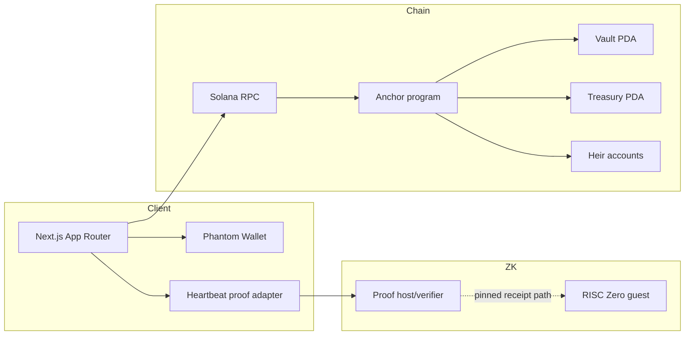
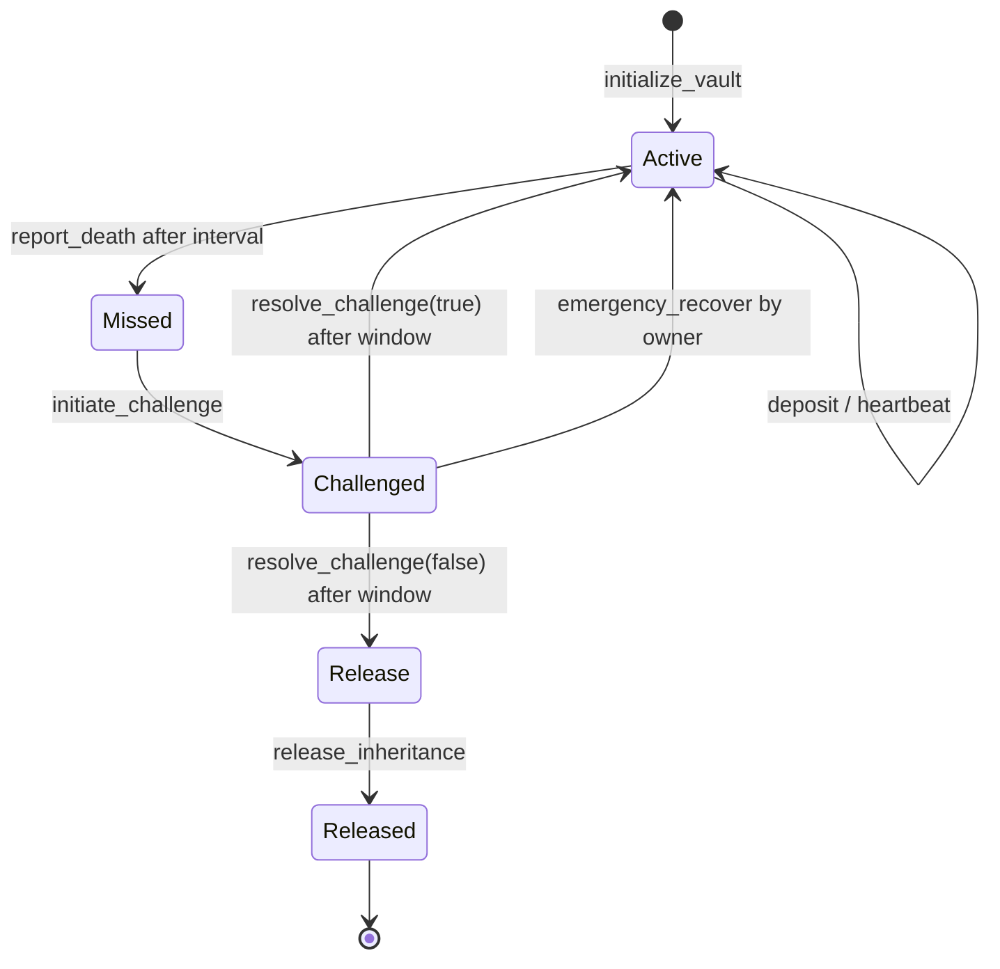
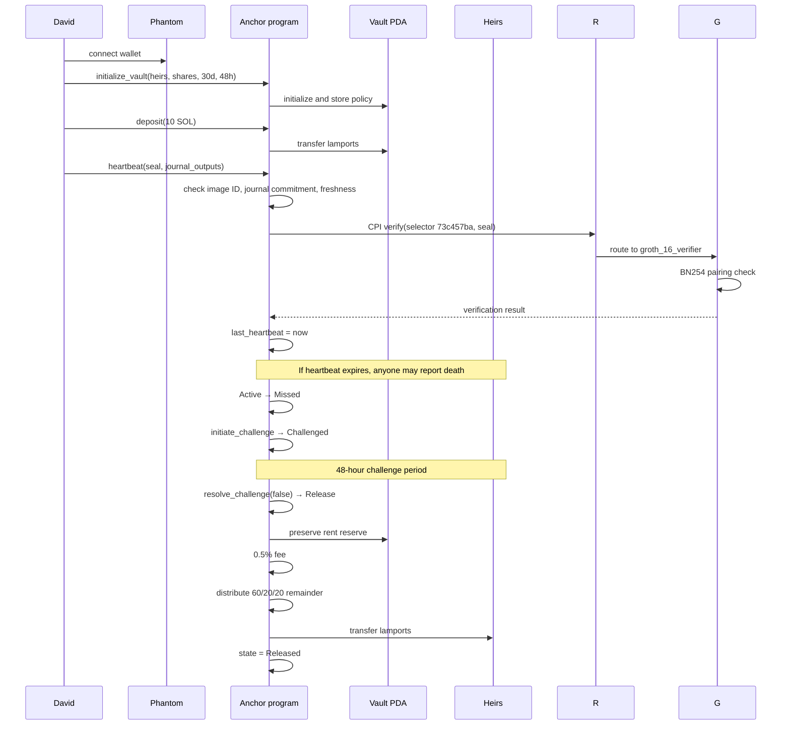

# DeathClock architecture

## Components

## State machine

## Full user flow

## Security boundaries

- The program validates owner signatures and PDA seeds for every owner-only action.
- `report_death`, `initiate_challenge`, `resolve_challenge`, and `release_inheritance` are permissionless after the state machine permits them.
- Treasury account input is checked against the canonical `[b"treasury"]` PDA and the supplied bump.
- The vault rent reserve is excluded from distributable value.
- The heartbeat is verified by CPI into the vendored `verifier_router`, which routes by selector `73c457ba` to `groth_16_verifier`, which performs the BN254 pairing check. This is a real RISC Zero Groth16 receipt, verified on-chain; there is no mock path in the program.
- The receipt is bound to a pinned guest image ID, so a proof from an attacker-chosen zkVM cannot satisfy the heartbeat.
- Journal validation and the 300-second freshness check run *before* the CPI. Note the ordering when reading errors: an `InvalidProof` at the freshness check does not indicate a pairing failure.
